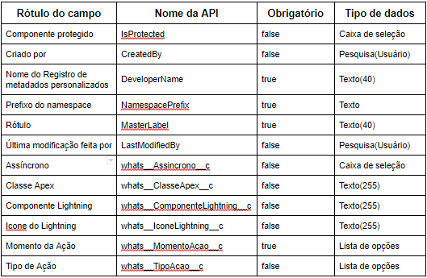

#################
Ação do Whatsapp
#################
A Ação do Whatsapp é o metadado utilizado para gerenciar as ações utilizadas na aplicação do Whastsapp.
Se o metadado utilizar uma Classe Apex deve implementar a interface WAActionInterfaceV2.
Se o metadado utilizar um Componente Lightning deve implementar o extends WAActionTemplate

