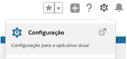
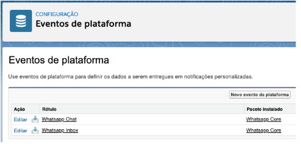

################################
Eventos de Plataforma
################################

Para acessar os Eventos de Plataforma:

Entre em Configuração.

    
Escreva evento na busca rápida e clique em Eventos de plataforma.

Nele constará os seguintes eventos utilizados pelo pacote.

    
Whatsapp Chat
~~~~~~~~~~~~~~
O evento Whatsapp Chat é chamado após o insert ou update de uma Mensagem do Whatsapp, atualizando o chat da Conversa do Whatsapp.

Whatsapp Inbox
~~~~~~~~~~~~~~~~
O evento Whatsapp Inbox é chamado após a mudança de status da Conversa do Whatsapp, sendo é responsável por atualizar todo o Inbox do Whatsapp.

.. Note:: Para maior aprofundamento ver também:
   
   
