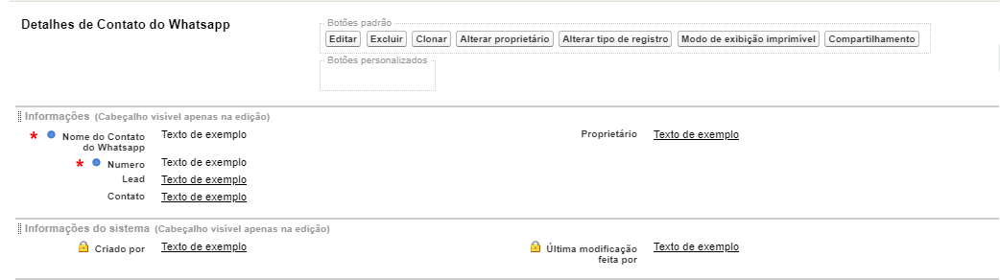

#################
Layout de Contato do Whatsapp
#################

Na seção de layout do Contato do Whatsapp encontramos um layout padrão. 
O layout padrão do Contato do Whatsapp apresenta os campos e botões abaixo abaixo:

    
Campos com um cadeado são campos de apenas leitura. Campos marcados com asterisco são
Definição dos campos:
  
  
.. Important::
     - Nome do Contato do Whatsapp: Nome que foi dado ao contato do whatsappp cadastrado
     - Numero: Numero que foi cadastrado ao contato do whatsappp
     - Lead: Lead vinculado ao contato do whatsappp
     - Contato: Contato vinculado ao contato do whatsappp
     - Proprietário: Criador da o contato do whatsappp
