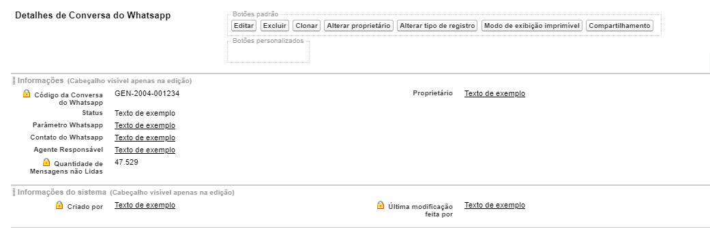

#################
Layout do Conversa do Whatsapp
#################

Na seção de layout do objeto Conversa do Whatsapp encontramos um layout padrão. 
O layout padrão do Conversa do Whatsapp apresenta os campos e botões abaixo abaixo:

    
Campos com um cadeado são campos de apenas leitura.

.. Important::
   - Definição dos campos:
    - Código da Conversa: Campo de nome da mensagem, um número gerado automaticamente através de uma mascara
    - Status: Status da conversa
    - Parâmetro Whatsapp: Código do parâmetro cadastrado
    - Contrato do Whatsapp: Contato cadastrado
    - Agente Responsável: Criador da conversa
    - Quantidade de Mensagens não Lidas: Mensagens que não foram visualizados
