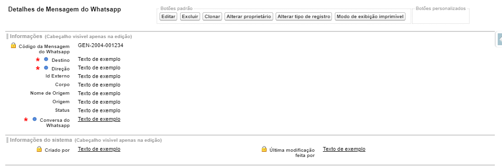

#################
Layout do Objeto Mensagem do Whatsapp
#################

Layout do Objeto Mensagem do Whatsapp
-----------------------
Na seção de layout do objeto Mensagem do Whatsapp encontramos um layout padrão. 
O layout padrão do Mensagem do Whatsapp apresenta os campos e botões abaixo abaixo:

    
Os campos marcados com um asterisco são os campos obrigatórios, campos que os dados deles precisam necessariamente serem preenchidos. Campos com um cadeado são campos de apenas leitura.

Definição dos campos:
  
  Código da Mensagem do Whatsapp: Campo de nome da mensagem, um número gerado automaticamente através de uma mascara 
  
  Destino: Numero para o qual a mensagem é mandada
  
  Direção: Difere 
  
  Id Externo: ID da mensagem no servidor
  
  Corpo: Conteúdo da mensagem
  
  Nome de Origem: Numero do qual a mensagem foi mandada com máscasa
  
  Origem: Numero do qual a mensagem foi mandada
  
  Status: Monstra se a mensagem foi enviada ou lida
  
  Conversar do Whatsapp: Código da conversa em que a mensagem foi enviada

