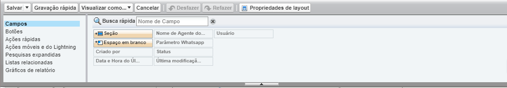

#################
Layouts de Páginas
#################

Contato do Whatsapp
-----------------------
Os layouts de páginas podem ser acessados através do gerenciador de objetos. Ao acessá-lo pode-se verificar e alterar uma série de informações sobre a amostragem do Objeto selecionado, como por exemplo:
  Campos
  Botões
  Ações Rápidas
  Ações Móveis e do Lightning
  Pesquisas Explandidas
  Listas Relacionadas
  Gráficos de Relatório
  

Os campos que já estão em página focam ináptos a serem escolhidos, os que ainda não foram inseridos podem ser arastados e levados até seção "Detralhae de nome-do-objeto"
onde podem serem soltos onde for conveniente.
Ao arrastar e soltar um campo, por exemplo, uma janela com as propriedades do campo abrirá na tela para que seja configurado como desejar. Esta ação é valida para todos os itens mostrados no layout, campos, botções, ações e etc.

.. image:: layout2.png
    :width: 500px
    :alt: Solidity logo
    :align: center

Verificar também:
  Layout de Mensagem do Whatsapp
  Layout de Conversa do Whatsapp
  Layout de Contato do Whatsapp
  Layout de Parâmetro do Whatsapp

