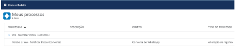

#################
Process Builder
#################

Para acessar o Process Builder:

Entre em Configuração.
.. image:: processbuilder1.png	
    :width: 500px
    :alt: Solidity logo
    :align: center
    
Escreva process na busca rápida e clique em Process Builder.

Nele constará o seguinte fluxo ligado ao pacote

WA - Notificar Inbox (Conversa)

O fluxo WA - Notificar Inbox (Conversa) é ligado ao objeto Conversa do Whatsapp, nele é criado um registro do evento Whatsapp Inbox quando o campo Status da Conversa do Whatsapp sofre alguma alteração.
