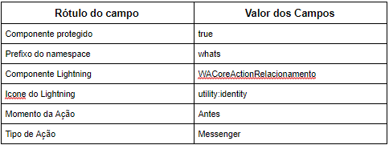

#################
Relacionar Contato ou Lead
#################

    
O metadado Relacionar Contato ou Lead é utilizado no componente WAMessenger para relacionar
um Contato do Whatsapp à um Contato ou uma Lead do Salesforce. O corpo e suas 
funcionalidades estão no componente lightning WACoreActionRelacionamento.
