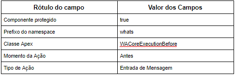

#################
WA Core Antes da Entrada Mensagem
#################

    
O metadado WA Core Antes da Entrada Mensagem utiliza a classe apex 
WACoreExecutionBefore que é chamado pelo acionador MensagemWhatsapp_biu, criando novas 
conversas caso a mensagem não tenha uma conversa relacionada e relacionando
mensagens com suas conversas já existentes.
