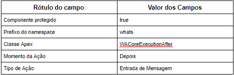

#################
WA Core Depois da Entrada Mensagem
#################

    
O metadado WA Core Depois da Entrada Mensagem utiliza a classe WACoreExecutionAfter que 
é chamado pelo acionador MensagemWhatsapp_aiu, dispara as mensagens para o servidor através 
da classe apex SendWhatsappMessage além de criar e publica uma lista de eventos com do tipo 
WhatsappChat__e.
