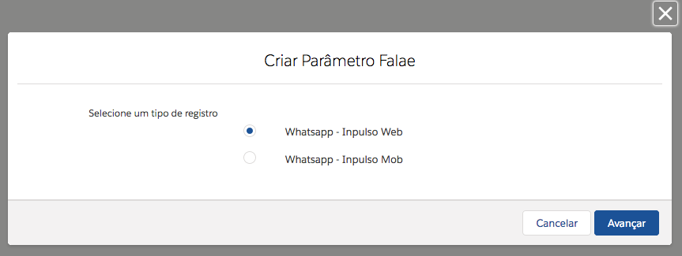
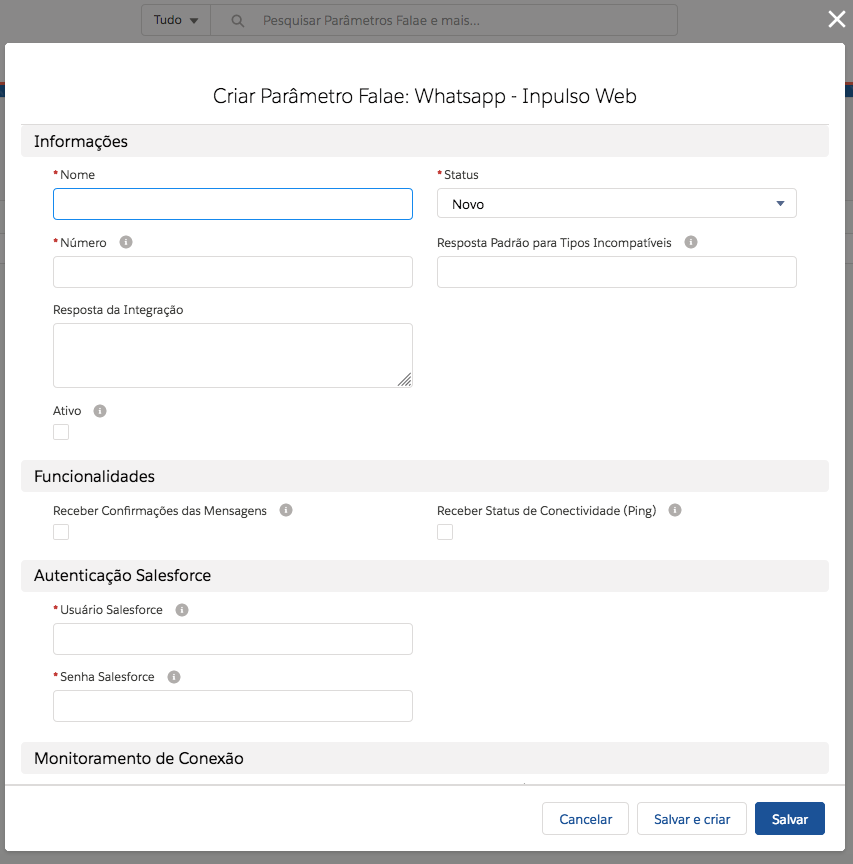
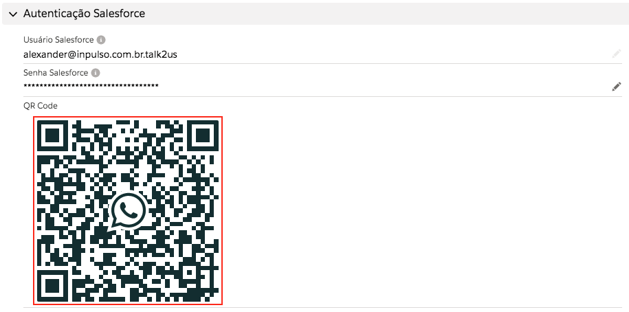

#################
Cadastro de novo parâmetro Whatsapp - Inpulso Web
#################

Para registrar um novo, vá na aba do Parâmetro do tipo Inpulso Web.
Clique em novo, selecione Whatsapp - Inpulso Web e clique em avançar.

    
Após isso aparece a seguinte tela de cadastro:    

Definições dos campos:

Nome: nome do Parâmetro Whatsapp. 

Número: número registrado no whatsapp a máscara é DDD+Número. Ex.: 13999887766. 

Resposta padrão para tipos incompatíveis: resposta para quando enviarem alguma mensagem que não foi possível interpretar (imagens, áudio, sticker, etc…). 

Ativo: quando ativo deixa o número conectado para o recebimento e envio de mensagens. (Na criação de um parâmetro que já será utilizado deixe ativado na criação). 

Receber Confirmações das Mensagens: quando ativo, recebe as confirmações das mensagens, podendo ser: Enviado Localmente, Enviado e Lido.

Receber Status de Conectividade (Ping): quando ativo, a seção "Monitoramento da Conexão" será atualizada constantemente quando o parâmetro estiver sendo executado.

Usuário Salesforce: seu usuário de login no salesforce. 

Senha Salesforce: sua senha mais a chave de segurança. 
Clique em Salvar.

.. Hint:: Quando aparecer erro na integração no campo Status o usuário ou a senha está incorreta.
          
    
.. Hint:: Quando tiver os dados certo e o Status para Registrado, será necessário entrar em contato conosco para a ativação da organização (caso seja o primeiro parâmetro da organização).  
    
Quando estiver no Status "Registrado" recarregue a página para aparecer o QR Code, para conectar o seu número será necessário escanear o QR Code que aparece na seção "Autenticação Salesforce". 

