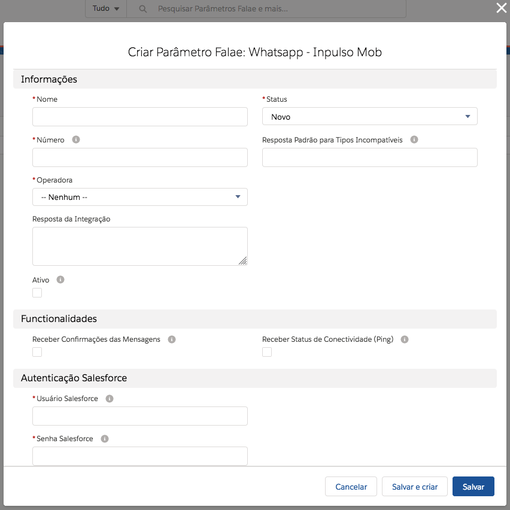
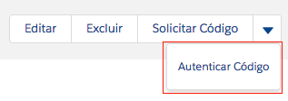
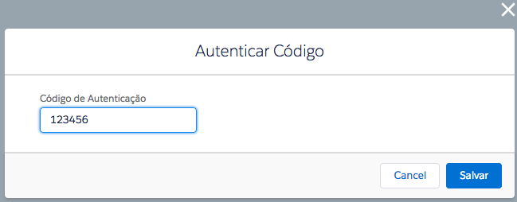
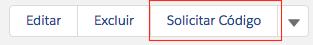
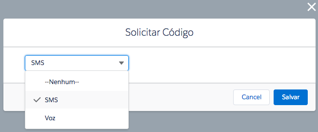

#################
Cadastro de novo parâmetro Whatsapp - Inpulso Mob
#################

Para registrar um novo, vá na aba do Parâmetro do tipo Inpulso Mob.
Clique em novo, selecione Whatsapp - Inpulso Mob e clique em avançar.

.. figure:: cadastroParametroMob1.png
    :width: 500px
    :alt: Solidity logo
    :align: center
    
    Modal de seleção do tipo do Parâmetro.
    
Após isso aparece a seguinte tela de cadastro:    

    
    Cadastro de um novo parâmetro do tipo Inpulso Mob.

Definições dos campos:

Nome: nome do Parâmetro Falae. 

Número: número registrado no whatsapp a máscara é DDD+Número. Ex.: 13999887766. 

Operadora: operadora do número que está cadastrando.

Resposta padrão para tipos incompatíveis: resposta para quando enviarem alguma mensagem que não foi possível interpretar. 

Ativo: quando ativo deixa o número conectado para o recebimento e envio de mensagens. (Na criação de um parâmetro que já será utilizado deixe ativado na criação). 

Receber Confirmações das Mensagens: quando ativo, recebe as confirmações das mensagens, podendo ser: Enviado Localmente, Enviado e Lido.

Receber Status de Conectividade (Ping): quando ativo, a seção "Monitoramento da Conexão" será atualizada constantemente quando o parâmetro estiver sendo executado.

Usuário Salesforce: seu usuário de login no salesforce. 

Senha Salesforce: sua senha mais a chave de segurança. 
Clique em Salvar.

.. Hint:: Quando aparecer erro na integração no campo Status o usuário ou a senha está incorreta.
          
    
.. Hint:: Quando tiver os dados certo e o Status para Registrando, será necessário entrar em contato conosco para a ativação da organização (caso a mesma não estiver ativada). 

Ao finalizar o cadastro de um novo parâmetro Whatsapp - Inpulso Mob, será enviado um código para autenticação do número, caso seja possível, caso contrário mostrará quanto tempo falta para enviar um novo código tanto para Voz quanto para SMS.

Para autenticar o código recebido, clique em Autenticar número:

    
    Botão para autenticar código recebido.

Insira o código recebido e clique em Salvar.

    
    Modal para enviar o código para verificação.

Caso precise solicitar um novo código, clique em Solicitar Código:

    
    Botão para solicitar um novo código.

Selecione o tipo de recebimento via SMS ou via Voz, após selecionado o tipo, clique em salvar.

    
    Modal selecionar o tipo que recebimento do código, podendo ser por SMS ou Voz.
