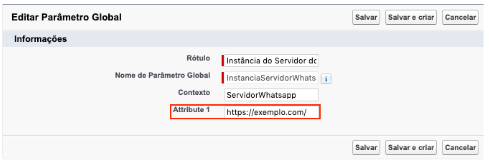
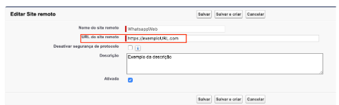

#####################################
Configuração de Endpoints do Servidor
#####################################

Após a configuração do domínio e a instalação do pacote WhatsappCore é necessário entrar em contato com a INPULSO para utilização do pacote. Entre em contato conosco.

Com a url que a INPULSO disponibilizar terá que inserir no Parâmetro Global e no Site Remoto.

Parâmetro Global

Entre na Configuração

.. image:: inbox1.png
    :width: 500px
    :alt: Solidity logo
    :align: center
 
Escreva metadados na busca rápida e clique em Tipos de metadados personalizados.
Clique em Gerenciar registros do lado esquerdo do Parâmetro Global.
Clique em Editar do lado esquerdo do Instância do Servidor Whatsapp.
Adicionar a url fornecida no campo Attribute 1 como no exemplo a seguir:

 
Após inserir a url, clique em Salvar.

Site Remoto

Entre na Configuração

.. image:: inbox1.png
    :width: 500px
    :alt: Solidity logo
    :align: center
 
Escreva site na busca rápida e clique em Configurações do site remoto.
Clique em Editar do lado esquerdo do WhatsappWeb.
Adicionar a url fornecida no campo URL do site remoto como no exemplo a seguir:

 
Após inserir a url, clique em Salvar.

