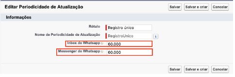

#####################################################
Configuração de periodicidade de atualização do Inbox
#####################################################

A periodicidade de atualização das mensagens é de 1 segundo por padrão, porém é possível modificar.

Para alterar o tempo de atualização:

Entre na Configuração

.. image:: Inbox1.png
    :width: 500px
    :alt: Solidity logo
    :align: center
 
Escreva metadados na busca rápida e clique em Tipos de metadados personalizados.
Clique em Gerenciar registros do lado esquerdo do Periodicidade de Atualização.
Clique em Editar do lado esquerdo do Registro único.
Aqui temos dois tempos:

 
Inbox do Whatsapp: é o tempo em milissegundos da atualização do Inbox do Whatsapp do APP Wahtsapp.
Messenger do Whatsapp: é o tempo em milissegundos da atualização do componente Messenger para Lead/Contato (Ainda em implementação)

