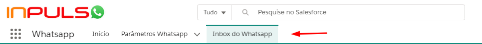
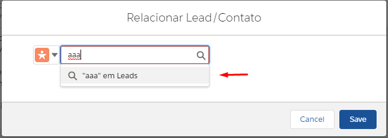

#################
Inbox do Whatsapp
#################

O Inbox do Whatsapp é acessado através da barra superior. Acessando-a é possível realizar as seguintes ações:

Selecionar Conversa
~~~~~~~~~~~~~~~~~~~~~~~~~~~~~~

    Barra superior da tela
    
Através da barra lateral esquerda pode-se pode-se selecionar qual conversa abrir. Através da conversa é possível ler as mensagens enviadas e responder ao cliente.

Vincular/Desvincular Conversa
~~~~~~~~~~~~~~~~~~~~~~~~~~~~~~

Dentro da conversa é possível vinculá-la a um lead ou uma conta através do botão apresentado no canto superior direito da mesma.

.. image:: Inbox2.png
    :width: 625px
    :alt: Solidity logo
    :align: center
    Selecionando botão de ações
    
Ao seleciona-lo um painel aparecerá na conversa, onde será possível selecionar se a conversa deve ser relacionada a um Lead ou a um Contato

.. image:: Inbox3.png
    :width: 500px
    :alt: Solidity logo
    :align: center
    Painel de vinculação/desvinculação
    
A desviculação da conversa é realizada através deste painel em uma conversa que já esteja vinculada. Para desvincular deve-se clicar no X onde está o nome da Conta/Lead e salvar, assim voltando para como seria no início da conversa

.. image:: Inbox5.png
    :width: 300px
    :alt: Solidity logo
    :align: center
    Ações a serem realizadas

A criação de uma Conta/Lead pode também ser realizada através deste painel. Ao pesquisar por um registro inexistente uma caixa de diálogo aparecerá, ao clicar nela um painel de pesquisa e criação de Conta/Lead será aberto, dependendo do que estiver sido selecionado previamente.

    Busca por um Contato/Lead que não existe

.. image:: Inbox7.png
    :width: 620px
    :alt: Solidity logo
    :align: center
    Seleção da opção Criar Lead/Criar Contato

.. image:: Inbox8.png
    :width: 620px
    :alt: Solidity logo
    :align: center
    Painel de criação de Contato/Lead
    
Após a criação a Conta/Lead pode ser vinculada a Conversa
