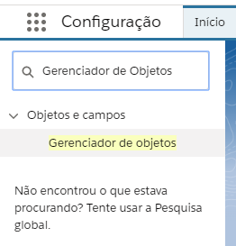

#################
Gerenciador de Objetos
#################
Através do Gerenciador de Objetos é possível encontrar diversas informações e funcionalidades dos objetos sendo possível altera-las caso o usuário possua as devidas permissões

Explorando o Gerenciador de Objetos
-----------------------
Para acessar o Gerenciador de Objetos deve-se abrir as configurações através do botão de Configurações

.. image:: layout1.png
    :width: 500px
    :alt: Solidity logo
    :align: center
    
Na lateral esquerda uma barra de buscas rápidas será aberta, consulte por Gerenciador de Objetos.

    
Ao abri-lo pode-se consultar todos os Objetos da Org, não só Personalizados como também os Objetos Padrões.
Os Objetos Personalizados apresentam dados confirmando que são personalizados, como a presença de um "__c" no nome da API e os campos Implantado e Peronalizado marcados, como pode-se notar no exemplo abaixo.

.. image:: layout3png
    :width: 500px
    :alt: Solidity logo
    :align: center
    
O primeiro campo, Implantado, informa se este Objeto está vigente na sua organização enquanto o segundo sinaliza que o mesmo é personalizado.
Ao selecionar o objeto desejado é possível acessar através da barra lateral esquerda: 
  Detalhes
  Campos e relacionamentos
  Layouts de página
  Páginas de Registro do Lightning
  Botões, Links e Ações
  Layouts compactos
  Campos definidos
  Limites do objeto
  Tipo de registro
  Filtros de pesquisa relacionados
  Acionadores
  Regras de validação

