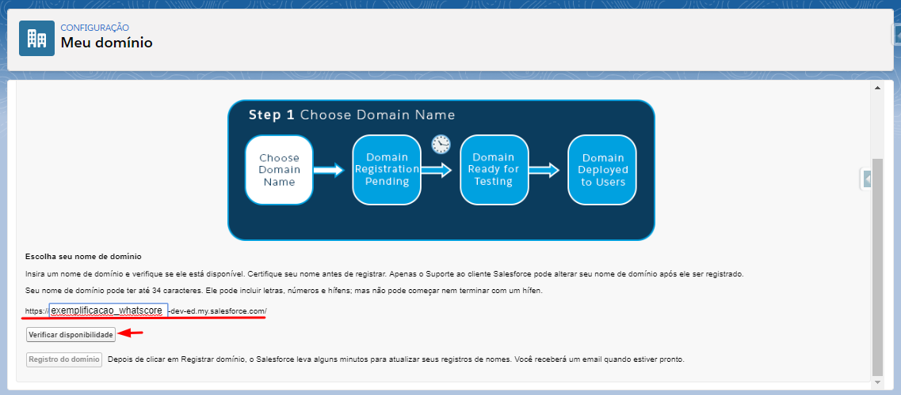
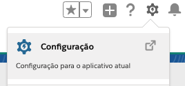
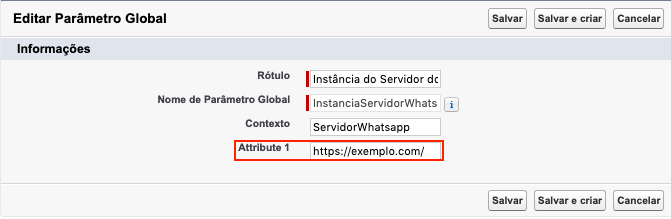
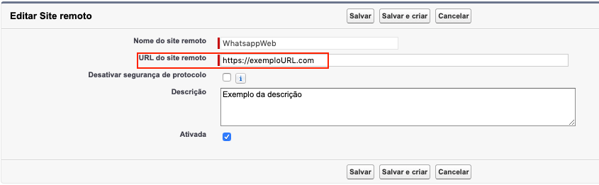
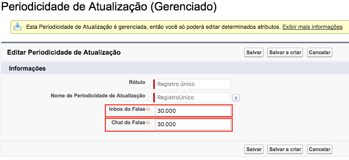

#################
Setup
#################

O objetivo deste documento é apontar os requisitos necessários e o passo-a-passo para a aplicação da funcionalidade e sua configuração em uma nova organização.

REGISTRO DE DOMÍNIO PARA A ORGANIZACAO
-----------------------

Para que o pacote possa ser baixado primariamente o usuário deve possuir uma organização no SalesForce que possua o domínio cadastrado. Para cadastrar um domínio o mesmo deve, através da barra de pesquisa acessada pelo botão Configuração, procurar por "Meu Domínio"

.. image:: instalacao4.png
    :width: 200px
    :alt: Solidity logo
    :align: center

Caso não tenha domínio cadastrado, deve-se escolher um nome para o domínio e verificar a validade do mesmo.

Após a validação confirmada, registrar o domínio do mesmo. Após o registro concluído, o SalesForce pedirá para que logue novamente. Tendo realizado estas ações, já com o domínio registrado, poderá seguir para a instalação do pacote

INSTALAÇÃO DO PACOTE GERENCIADO
-----------------------
	

O download do pacote para a sua organização deve ser realizado através do link abaixo
         
         https://login.salesforce.com/packaging/installPackage.apexp?p0=04t1U000007Pb3G
         
O login na sua organização será requerido, e após o a realização será automaticamente redirecionado para a tela de download do pacote, onde será necessário marcar as opções apresentadas abaixo:

.. image:: instalacao1.png
    :width: 200px
    :alt: Solidity logo
    :align: center

Logo após a confirmação uma notificação aparecerá, sendo necessária a confirmação do seguinte item:
   
.. image:: instalacao2.png
    :width: 200px
    :alt: Solidity logo
    :align: center
    
Depois da confirmação das opções anteriores o download começará normalmente, demorando entre 1 a 3 minutos. Após a confirmação do encerramento do download a apliacação já estará visível para o cliente através dos aplicativos do SalesForce.

.. image:: instalacao3.png
    :width: 200px
    :alt: Solidity logo
    :align: center
        
CONFIGURACAO DE PERIODICIDADE DE ATUALIZACAO DO INBOX
-----------------------

Após a configuração do domínio e a instalação do pacote WhatsappCore é necessário entrar em contato com a INPULSO para utilização do pacote. Entre em contato através de “XXXXXXXXXXXXXXXXXXXXX”.

Com a url que a INPULSO disponibilizar terá que inserir no Parâmetro Global e no Site Remoto.

Parâmetro Global

Entre na Configuração

    
Escreva metadados na busca rápida e clique em Tipos de metadados personalizados.
Clique em Gerenciar registros do lado esquerdo do Parâmetro Global.
Clique em Editar do lado esquerdo do Instância do Servidor Whatsapp.
Adicionar a url fornecida no campo Attribute 1 como no exemplo a seguir:

    
Após inserir a url, clique em Salvar.

Site Remoto

Entre na Configuração
Escreva site na busca rápida e clique em Configurações do site remoto.
Clique em Editar do lado esquerdo do WhatsappWeb.
Adicionar a url fornecida no campo URL do site remoto como no exemplo a seguir:

    
Após inserir a url, clique em Salvar.

    
CONFIGURACAO DE PERIODICIDADE DE ATUALIZACAO DO INBOX
-----------------------
	
A periodicidade de atualização das mensagens é de 1 segundo por padrão, porém é possível modificar.

Para alterar o tempo de atualização:

Entre na Configuração

Escreva metadados na busca rápida e clique em Tipos de metadados personalizados.
Clique em Gerenciar registros do lado esquerdo do Periodicidade de Atualização.
Clique em Editar do lado esquerdo do Registro único.
Aqui temos dois tempos:

Inbox do Whatsapp: é o tempo em milissegundos da atualização do Inbox do Whatsapp do APP Wahtsapp.
Messenger do Whatsapp: é o tempo em milissegundos da atualização do componente Messenger para Lead/Contato (Ainda em implementação).

