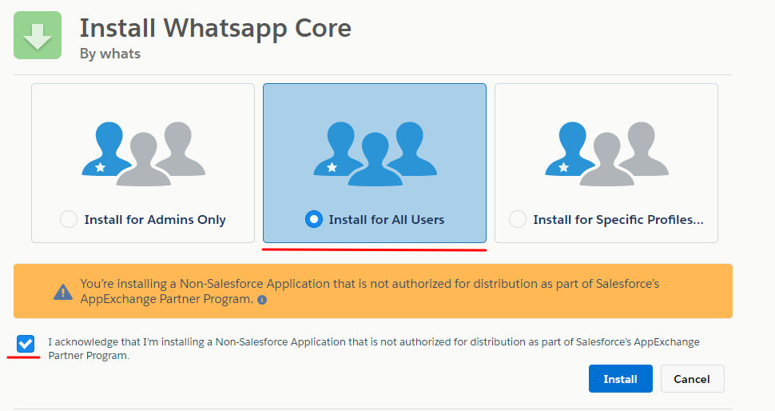
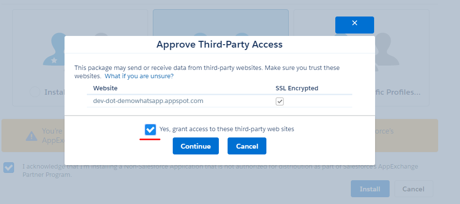
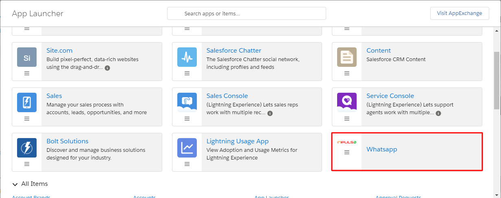

#################
Setup
#################

REGISTRO DE DOMÍNIO PARA A ORGANIZACAO
-----------------------

.. image:: instalacao4.png
    :width: 80px
    :alt: Solidity logo
    :align: center

INSTALAÇÃO DO PACOTE GERENCIADO
-----------------------
	
	O objetivo deste documento é apontar os requisitos necessários e o passo-a-passo para a aplicação da funcionalidade e sua configuração em uma nova organização.
   Primariamente o usuário deve possuir uma organização no SalesForce. O download ddo pacote para a sua organização deve ser realizado através do link abaixo
         
         https://login.salesforce.com/packaging/installPackage.apexp?p0=04t1U000007Pb3G
         
   O login na sua organização será requerido, e após o a realização será automaticamente redirecionado para a tela de download do pacote, onde será necessário marcar as opções apresentadas abaixo:

   Logo após a confirmação uma notificação aparecerá, sendo necessária a confirmação do seguinte item:
   

    
    Depois da confirmação das opções anteriores o download começará normalmente, demorando entre 1 a 3 minutos. Após a confirmação do encerramento do download a apliacação já estará visível para o cliente através dos aplicativos do SalesForce.

    
