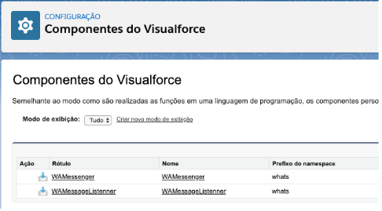
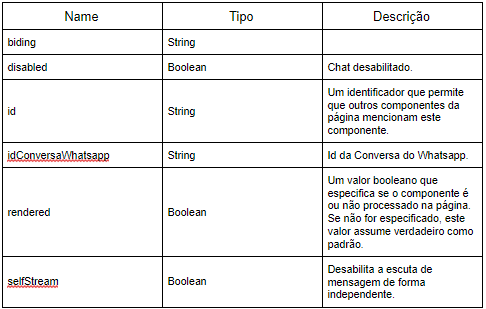

#################
Componentes do Visualforce
#################

Para acessar os Componentes do Visualforce:

Entre em Configuração.

.. image:: 1.png
    :width: 300px
    :alt: Solidity logo
    :align: center
    
Escreva componentes na busca rápida e clique em Componentes do Visualforce.

Nele constará os seguintes componentes do visualforce ligado ao pacote instalado:

WAMessenger
----------------
O WAMessenger é utilizado na página visualforce WAMessenger (páginas não se encontra no pacote), contendo os seguintes atributos:

Acesso: global

Atributos:

WAMessageListenner
-------------------
Não é utilizado (Verificar com Alex para ver se é sujeira)

Acesso: 	public
