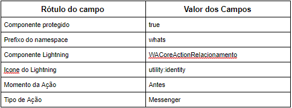
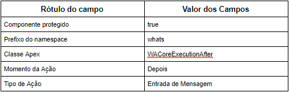

Ação do Whatsapp

A Ação do Whatsapp é o metadado utilizado para gerenciar as ações utilizadas na aplicação do Whastsapp.
Se o metadado utilizar uma Classe Apex deve implementar a interface WAActionInterfaceV2.
Se o metadado utilizar um Componente Lightning deve implementar o extends WAActionTemplate.

.. image:: metadados1.png
    :width: 500px
    :alt: Solidity logo
    :align: center
 
Relacionar Contato ou Lead
 

 
O metadado Relacionar Contato ou Lead é utilizado no componente WAMessenger para relacionar um Contato do Whatsapp à um Contato ou uma Lead do Salesforce. O corpo e suas funcionalidades estão no componente lightning WACoreActionRelacionamento.

WA Core Antes da Entrada Mensagem
 
.. image:: metadados3.png
    :width: 500px
    :alt: Solidity logo
    :align: center
    
O metadado WA Core Antes da Entrada Mensagem utiliza a classe apex WACoreExecutionBefore que é chamado pelo acionador MensagemWhatsapp_biu, criando novas conversas caso a mensagem não tenha uma conversa relacionada e relacionando mensagens com suas conversas já existentes.

WA Core Depois da Entrada Mensagem
 

   
O metadado WA Core Depois da Entrada Mensagem utiliza a classe WACoreExecutionAfter que é chamado pelo acionador MensagemWhatsapp_aiu, dispara as mensagens para o servidor através da classe apex SendWhatsappMessage além de criar e publica uma lista de eventos com do tipo WhatsappChat__e.
 
