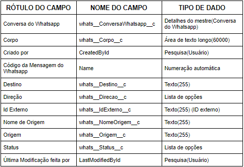

#################
Objetos Personalizados
#################

Contato do Whatsapp
-----------------------
O objeto contato do whatsapp é criado para ser a referência de um número de whatsapp de um cliente.

.. image:: tabelaobjeto3.png
    :width: 400px
    :alt: Solidity logo
    :align: center
    

Conversa do Whatsapp
-----------------------
O objeto conversa do whatsapp tem um registro para cada conversa de um contato do whatsapp com um parâmetro do whatsapp.

.. image:: tabelaobjeto2.png
    :width: 400px
    :alt: Solidity logo
    :align: center

.. Important::
   Referências:
    Acionadores Apex:
      -`ConversaWhatsapp_aiu`_
      
      -`ConversaWhatsapp_biu`_

Parâmetro Whatsapp
-----------------------
O objeto parâmetro whatsapp é um registro para os clientes entrarem em contato via Whatsapp.

.. image:: tabelaobjeto3.png
    :width: 400px
    :alt: Solidity logo
    :align: center

.. Important::
   Referências:
    Acionadores Apex:
      -`ParametroWhatsapp_aiu`_
    Página Visualforce:
      -`WAQrRequest`_
    

Mensagem do Whatsapp
-----------------------
O objeto mensagem do whatsapp contém registrado todas as mensagens enviadas de uma conversa, tanto do cliente para o parâmetro, quanto parâmetro para cliente.

    
  
.. Important::
   Referências:
    Acionadores Apex:
      -`MensagemWhatsapp_aiu`_
      
      -`MensagemWhatsapp_biu`_

.. _WAQrRequest : https://whatsapp-teste.readthedocs.io/en/latest/Tecnico/P%C3%A1ginas%20do%20Visualforce/P%C3%A1ginas%20do%20Visualforce.html#waqrrequest
.. _SendWhatsappMessage : https://whatsapp-teste.readthedocs.io/en/latest/Tecnico/SendWhatsappMessenger.html?highlight=SendWhatsappMessage
.. _ParametroWhatsapp_aiu : https://whatsapp-teste.readthedocs.io/en/latest/Tecnico/Acionadores.html?highlight=acionadores#parametrowhatsapp-aiu
.. _ConversaWhatsapp_biu : https://whatsapp-teste.readthedocs.io/en/latest/Tecnico/Acionadores.html?highlight=acionadores#conversawhatsapp-biu
.. _ConversaWhatsapp_aiu : https://whatsapp-teste.readthedocs.io/en/latest/Tecnico/Acionadores.html?highlight=acionadores#conversawhatsapp-aiu
.. _SendWhatsappMessage : https://whatsapp-teste.readthedocs.io/en/latest/Tecnico/SendWhatsappMessenger.html?highlight=SendWhatsappMessage
.. _MensagemWhatsapp_aiu : https://whatsapp-teste.readthedocs.io/en/latest/Tecnico/Acionadores.html?highlight=acionadores#mensagemwhatsapp-aiu
.. _MensagemWhatsapp_biu : https://whatsapp-teste.readthedocs.io/en/latest/Tecnico/Acionadores.html?highlight=acionadores#mensagemwhatsapp-biu
