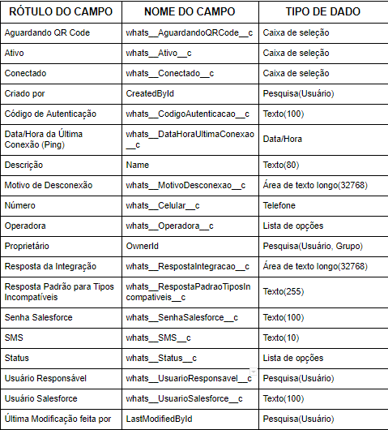

#################
Objetos Personalizados
#################

Contato do Whatsapp
-----------------------
O objeto contato do whatsapp é criado para ser a referência de um número de whatsapp de um cliente.

    
    
Referências:

Classe Apex:
    WACoreExecutionBefore
    WAMessenger_ctl

Conversa do Whatsapp
-----------------------
O objeto conversa do whatsapp tem um registro para cada conversa de um contato do whatsapp com um parâmetro do whatsapp.

.. image:: tabelaobjeto2.png
    :width: 400px
    :alt: Solidity logo
    :align: center
    
Referências:

Classe Apex:
    ConversaWhatsappHandler
    WAActionHandler
    WAActionInterface
    WAActionInterfaceV2
    WACoreExecutionAfter
    WACoreExecutionBefore
    WAInboxMessenger_ctl
    WAInboxUser_ctl
    WAMessenger_ctl
Acionadores Apex:
    `ConversaWhatsapp_aiu`_
    
    `ConversaWhatsapp_biu`_

Parâmetro Whatsapp
-----------------------
O objeto parâmetro whatsapp é um registro para os clientes entrarem em contato via Whatsapp.

Referências:

Classe Apex:
    ParametroWhatsappHandler
    `SendWhatsappMessage`_
    WACoreExecutionBefore
    WAMessenger_ctl
    WAQrRequest_ctl
    WAQrView_ctl
Acionadores Apex:
    `ParametroWhatsapp_aiu`_
Página Visualforce:
    WAQrRequest
    WAQrView

.. _SendWhatsappMessage : https://whatsapp-teste.readthedocs.io/en/latest/Tecnico/SendWhatsappMessenger.html?highlight=SendWhatsappMessage
.. _ParametroWhatsapp_aiu : https://whatsapp-teste.readthedocs.io/en/latest/Tecnico/Acionadores.html?highlight=acionadores#parametrowhatsapp-aiu
.. _ConversaWhatsapp_biu : https://whatsapp-teste.readthedocs.io/en/latest/Tecnico/Acionadores.html?highlight=acionadores#conversawhatsapp-biu
.. ConversaWhatsapp_aiu : https://whatsapp-teste.readthedocs.io/en/latest/Tecnico/Acionadores.html?highlight=acionadores#conversawhatsapp-aiu
.. _SendWhatsappMessage : https://whatsapp-teste.readthedocs.io/en/latest/Tecnico/SendWhatsappMessenger.html?highlight=SendWhatsappMessage
