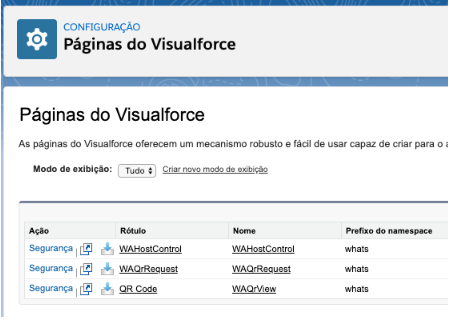
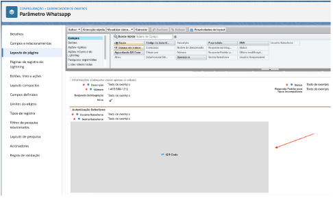
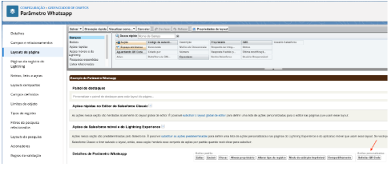

Para acessar os Componentes do Visualforce:

Entre em Configuração.
.. image:: 1.png
    :width: 500px
    :alt: Solidity logo
    :align: center
Escreva páginas na busca rápida e clique em Páginas do Visualforce.

Nele constará as seguintes páginas do visualforce ligado ao pacote instalado:

WAHostControl
--------------
O WAHostControl é utilizado para pegar o host da org.

QR Code

O QR Code é campo utilizado no layout de página do objeto Parâmetro Whatsapp, nele é apresentado o QR Code para conectar o whatsapp no servidor.

WAQrRequest
-------------
O WAQrRequest é um botão personalizado utilizado no layout de página do objeto Parâmetro Whatsapp, ao clicar nele, solicita um QR Code ao servidor.

