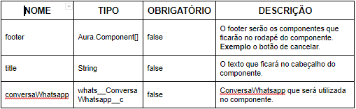

#################
WAActionTemplate
#################
O WAActionTemplate é o extends obrigatório caso queira usar um componente lightning no metadado Ação do Whatsapp do Tipo Messenger. Ele funciona como uma modal, com o layout separado em três partes, cabeçalho, corpo e rodapé.
Nele temos os seguintes atributos:

Além dos atributos, tem um método para fechamento da modal close().

Exemplo de utilização do componente como extends:

   .. code-block:: apex
   
      <aura:component extends="whats:WAActionTemplate" >
         <!-- Header -->
         <aura:set attribute="title" value="Relacionar Lead/Contato " />
         <!-- Footer -->
         <aura:set attribute="footer">
             <lightning:button variant="Neutral" label="Cancelar" title="Cancelar" onclick="{! c.close }" />
         </aura:set>

         <!-- Content -->
         <lightning:layout>         
             <!-- LookupField -->
             <lightning:layoutItem flexibility="auto" size="6" >
                 <lightning:recordEditForm aura:id="recordViewForm"
                     onsubmit="{!c.close}"
                     recordId="{!v.conversaWhatsapp.whats__ContatoWhatsapp__c}"
                     objectApiName="whats__ContatoWhatsapp__c">
                     <lightning:inputField aura:id="lead"
                         fieldName="whats__Lead__c"/>
                 </lightning:recordEditForm>
             </lightning:layoutItem>
         </lightning:layout>
